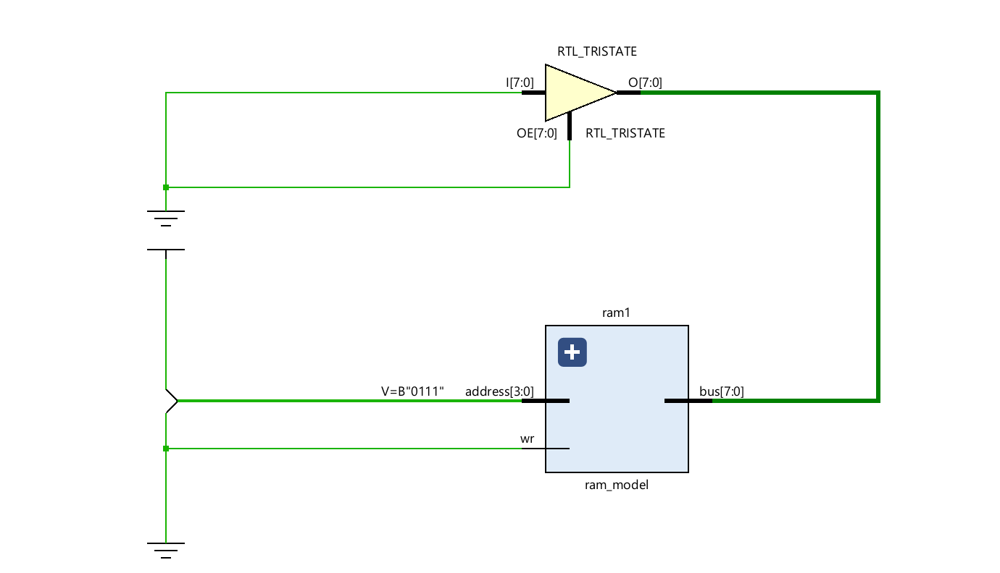
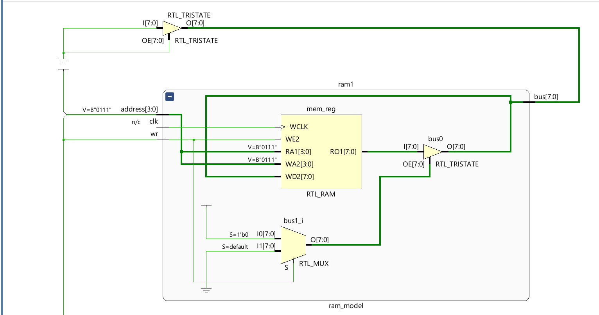
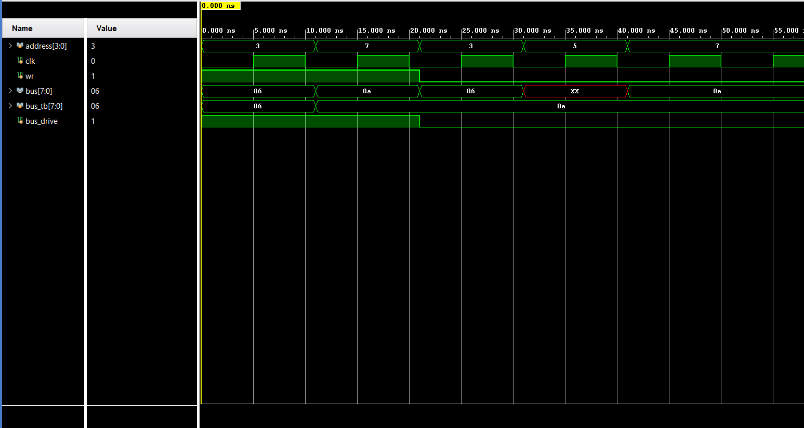

# 16 x 8 bits Synchronous RAM

Built a synchronous 16 x 8 bits synchronous RAM which decodes which memory byte to choose by using a 4bit Address Decoder,
Implemented and verified in Vivado using testbenches

## Overview:

RAM consisting of 16 memory elements each 1 byte or 8 bits long.
The idea is to connect the RAM to the main tri-state bus which will enable to read and write the bus value depending on what is needed.

## Operations Included:

| Operation | Symbol | Function |
| :--- | :--- | :--- |
|**Address**|`address`| a 4-bit-Input which helps in decoding which memory element is to be used. |
|**Write_Read**|`wr`| writes the value from the bus lines to  memory element when `wr` = 1 and reads the value from the memory element when `wr` = 1.|
|**Insert Bus Value**|`bus_tb`| drives the bus-lines with the desired input value from our side|
|**Drive the Bus**|`bus_drive`| regulates whether to drive the bus with `bus_tb` or not|

## Schematic

### Full Model

### RAM Module

## Simulation Results

